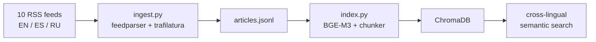

# News Prisma

> *Reveals how the same story looks different through English, Spanish, and Russian media.*

A multilingual agentic RAG system that indexes news from EN/ES/RU sources and answers questions like: *"How is topic X covered differently across these three media ecosystems?"*

<!-- vscode-markdown-toc -->
* [Overview](#Overview)
* [Setup](#Setup)
	* [Prerequisites](#Prerequisites)
	* [Clone and create a virtual environment](#Cloneandcreateavirtualenvironment)
* [Ingestion](#Ingestion)
* [Indexing](#Indexing)
* [Tech stack](#Techstack)

<!-- vscode-markdown-toc-config
	numbering=false
	autoSave=true
	/vscode-markdown-toc-config -->
<!-- /vscode-markdown-toc -->

## <a name='Overview'></a>Overview

RSS feeds → clean article text → sentence-aware chunks → multilingual embeddings → semantic search across EN, ES, and RU in a single vector store.



| Source | Language | Origin |
|---|---|---|
| BBC News | EN | UK |
| Al Jazeera | EN | Qatar |
| The Guardian | EN | UK |
| TASS | EN | Russia (state) |
| El País | ES | Spain |
| El Mundo | ES | Spain |
| BBC Mundo | ES | UK/LatAm |
| Meduza | RU | Latvia (exile) |
| Interfax | RU | Russia (independent) |
| Lenta.ru | RU | Russia |

---

## <a name='Setup'></a>Setup

### <a name='Prerequisites'></a>Prerequisites

- Python 3.11+
- [`uv`](https://docs.astral.sh/uv/) (recommended) or `pip`

### <a name='Cloneandcreateavirtualenvironment'></a>Clone and create a virtual environment

```bash
git clone https://github.com/msalunina/news-prisma.git
cd news-prisma

# with uv
uv venv --python 3.11
source .venv/bin/activate
uv pip install -e .

# or with plain pip
python3.11 -m venv .venv
source .venv/bin/activate
pip install -e .
```

<!-- ### 2. Configure environment variables

```bash
cp .env.example .env
# Edit .env and fill in your API keys 
``` -->

---

## <a name='Ingestion'></a>Ingestion

```bash
python scripts/ingest.py
```

This will:
1. Fetch RSS feeds from all 10 sources (EN/ES/RU)
2. Deduplicate articles by URL and normalised title
3. Download and extract clean article text via [trafilatura](https://trafilatura.readthedocs.io/)
4. Save results to `data/snapshots/articles_YYYY_MM.jsonl`

**Options:**

```bash
# Faster run — saves RSS metadata + summary only, skips full article download
python scripts/ingest.py --skip-parse

# Limit articles per source (default: 50)
python scripts/ingest.py --max-per-source 3

# Custom output path
python scripts/ingest.py --output data/snapshots/my_snapshot.jsonl
```

**Example output:**

```

...

19:27:05 [INFO] newsprisma.ingestion.rss_fetcher — Fetching BBC Mundo (http://www.bbc.co.uk/mundo/index.xml) …
19:27:06 [INFO] newsprisma.ingestion.rss_fetcher —   → 55 articles from BBC Mundo
19:27:06 [INFO] newsprisma.ingestion.rss_fetcher — Fetching Meduza (https://meduza.io/rss/all) …
19:27:06 [INFO] newsprisma.ingestion.rss_fetcher —   → 30 articles from Meduza
19:27:06 [INFO] newsprisma.ingestion.rss_fetcher — Fetching Interfax (https://www.interfax.ru/rss.asp) …
19:27:07 [INFO] newsprisma.ingestion.rss_fetcher —   → 25 articles from Interfax
19:27:07 [INFO] newsprisma.ingestion.rss_fetcher — Fetching Lenta.ru (https://lenta.ru/rss/news) …
19:27:08 [INFO] newsprisma.ingestion.rss_fetcher —   → 200 articles from Lenta.ru
19:27:08 [INFO] ingest — Fetched 693 raw articles total
19:27:08 [INFO] ingest — After deduplication: 690 articles
19:27:08 [INFO] ingest —   BBC News: keeping 3 / 41 articles
19:27:08 [INFO] ingest —   Al Jazeera: keeping 3 / 25 articles
19:27:08 [INFO] ingest —   The Guardian: keeping 3 / 45 articles
19:27:08 [INFO] ingest —   TASS: keeping 3 / 98 articles
19:27:08 [INFO] ingest —   El País: keeping 3 / 144 articles
19:27:08 [INFO] ingest —   El Mundo: keeping 3 / 28 articles
19:27:08 [INFO] ingest —   BBC Mundo: keeping 3 / 55 articles
19:27:08 [INFO] ingest —   Meduza: keeping 3 / 30 articles
19:27:08 [INFO] ingest —   Interfax: keeping 3 / 25 articles
19:27:08 [INFO] ingest —   Lenta.ru: keeping 3 / 199 articles
19:27:08 [INFO] ingest — Total articles to process: 30
19:27:13 [INFO] ingest — Progress: 20 / 30
19:27:15 [INFO] ingest — ============================================================
19:27:15 [INFO] ingest — Done! Wrote 30 articles to data/snapshots/articles_2026_03.jsonl
19:27:15 [INFO] ingest — Language breakdown: EN=12  ES=9  RU=9
19:27:15 [INFO] ingest — Articles without full text (metadata only): 0
```

**JSONL record format:**

```json
{
  "url": "https://www.bbc.com/news/world-...",
  "title": "UN calls for ceasefire",
  "language": "en",
  "source_name": "BBC News",
  "source_origin": "UK",
  "published_at": "2026-03-27T09:00:00+00:00",
  "summary": "The United Nations has called...",
  "tags": ["world", "politics"],
  "text": "Full extracted article body...",
  "ingested_at": "2026-03-27T11:46:43+00:00"
}
```

---

## <a name='Indexing'></a>Indexing

```bash
python scripts/index.py
```

This will:
1. Load the latest JSONL snapshot
2. Split each article into sentence-aware chunks
3. Embed them with [BGE-M3](https://huggingface.co/BAAI/bge-m3)
4. Store everything in a local ChromaDB vector store


BGE-M3 is a single multilingual model trained on 100+ languages, which means no language-specific handling needed. A Russian query will retrieve semantically similar English and Spanish chunks out of the box.

**Example output:**

```
NewsPrisma — Indexing
Snapshot : data/snapshots/articles_2026_03.jsonl
ChromaDB : data/chroma_db
Model    : BAAI/bge-m3

Loaded 30 articles
  en: 12 articles
  es: 9 articles
  ru: 9 articles

Chunking & indexing… ━━━━━━━━━━━━━━━━━━━━━━━━━━━━━━━━━━━━━━━━ 100%

Done! Indexed 223 chunks from 30 articles.
Collection totals: 223 chunks total
  en: 91 chunks
  es: 107 chunks
  ru: 25 chunks
```

**Cross-lingual retrieval in action** (Python shell):

```python
from newsprisma.indexing.embedder import Embedder
from newsprisma.indexing.store import VectorStore

store = VectorStore("data/chroma_db")
embedder = Embedder("BAAI/bge-m3")

# Russian query — retrieves relevant EN and ES chunks
results = store.query(embedder.encode_query("нефть экспорт Ближний Восток"), top_k=3)
# [en] Al Jazeera  score=0.569  Saudi, UAE, Iraq: Can three pipelines help oil escape…
# [es] El Mundo    score=0.548  El destino es el puerto de Fujairah, en el Golfo de Omán…
# [en] Al Jazeera  score=0.534  However, oil exports from Fujairah do appear to have risen…
```

---

## <a name='Techstack'></a>Tech stack

| Component | Choice |
|---|---|
| Language | Python 3.11 |
| Package manager | `uv` |
| RSS parsing | `feedparser` |
| Article extraction | `trafilatura` |
| Embeddings | `BAAI/bge-m3` via `sentence-transformers` |
| Vector store | `chromadb` |
| Config | `pydantic-settings` |
| Testing | `pytest` + `pytest-mock` |
