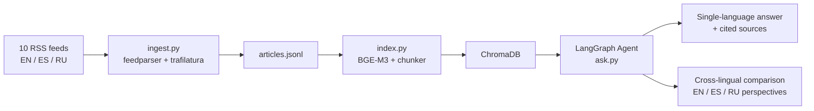
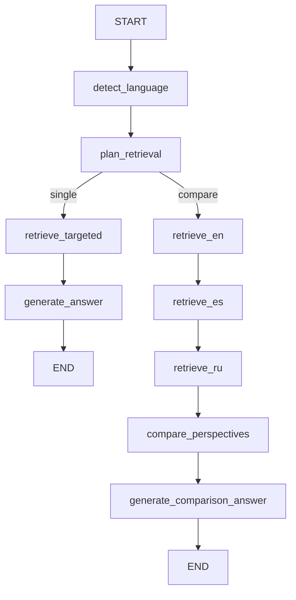

# News Prisma

> *Reveals how the same story looks different through English, Spanish, and Russian media.*

A multilingual agentic RAG system that indexes news from EN/ES/RU sources and answers questions like: *"How is topic X covered differently across these three media ecosystems?"*

<!-- vscode-markdown-toc -->
* [Overview](#Overview)
* [Setup](#Setup)
	* [Prerequisites](#Prerequisites)
	* [Clone and create a virtual environment](#Cloneandcreateavirtualenvironment)
	* [Configure environment variables](#Configureenvironmentvariables)
* [Ingestion](#Ingestion)
* [Indexing](#Indexing)
* [Agent - ask a question](#Agent-askaquestion)
* [Tech stack](#Techstack)

<!-- vscode-markdown-toc-config
	numbering=false
	autoSave=true
	/vscode-markdown-toc-config -->
<!-- /vscode-markdown-toc -->

## <a name='Overview'></a>Overview

RSS feeds → clean article text → sentence-aware chunks → multilingual embeddings → LangGraph agent → grounded answers with cross-lingual perspective comparison across EN, ES, and RU.



**Agent graph:**



| Source | Language | Origin |
|---|---|---|
| BBC News | EN | UK |
| Al Jazeera | EN | Qatar |
| The Guardian | EN | UK |
| TASS | EN | Russia (state) |
| El País | ES | Spain |
| El Mundo | ES | Spain |
| BBC Mundo | ES | UK/LatAm |
| Meduza | RU | Latvia (exile) |
| Interfax | RU | Russia (independent) |
| Lenta.ru | RU | Russia |

---

## <a name='Setup'></a>Setup

### <a name='Prerequisites'></a>Prerequisites

- Python 3.11+
- [`uv`](https://docs.astral.sh/uv/) (recommended) or `pip`

### <a name='Cloneandcreateavirtualenvironment'></a>Clone and create a virtual environment

```bash
git clone https://github.com/msalunina/news-prisma.git
cd news-prisma

# with uv
uv venv --python 3.11
source .venv/bin/activate
uv pip install -e .

# or with plain pip
python3.11 -m venv .venv
source .venv/bin/activate
pip install -e .
```

### <a name='Configureenvironmentvariables'></a>Configure environment variables

```bash
cp .env.example .env
# Fill in GROQ_API_KEY (required for RAG answers)
```

---

## <a name='Ingestion'></a>Ingestion

```bash
python scripts/ingest.py
```

This will:
1. Fetch RSS feeds from all 10 sources (EN/ES/RU)
2. Deduplicate articles by URL and normalised title
3. Download and extract clean article text via [trafilatura](https://trafilatura.readthedocs.io/)
4. Save results to `data/snapshots/articles_YYYY_MM.jsonl`

**Options:**

```bash
# Faster run — saves RSS metadata + summary only, skips full article download
python scripts/ingest.py --skip-parse

# Limit articles per source (default: 50)
python scripts/ingest.py --max-per-source 3

# Custom output path
python scripts/ingest.py --output data/snapshots/my_snapshot.jsonl
```

**Example output:**

```

...

19:27:05 [INFO] newsprisma.ingestion.rss_fetcher — Fetching BBC Mundo (http://www.bbc.co.uk/mundo/index.xml) …
19:27:06 [INFO] newsprisma.ingestion.rss_fetcher —   → 55 articles from BBC Mundo
19:27:06 [INFO] newsprisma.ingestion.rss_fetcher — Fetching Meduza (https://meduza.io/rss/all) …
19:27:06 [INFO] newsprisma.ingestion.rss_fetcher —   → 30 articles from Meduza
19:27:06 [INFO] newsprisma.ingestion.rss_fetcher — Fetching Interfax (https://www.interfax.ru/rss.asp) …
19:27:07 [INFO] newsprisma.ingestion.rss_fetcher —   → 25 articles from Interfax
19:27:07 [INFO] newsprisma.ingestion.rss_fetcher — Fetching Lenta.ru (https://lenta.ru/rss/news) …
19:27:08 [INFO] newsprisma.ingestion.rss_fetcher —   → 200 articles from Lenta.ru
19:27:08 [INFO] ingest — Fetched 693 raw articles total
19:27:08 [INFO] ingest — After deduplication: 690 articles
19:27:08 [INFO] ingest —   BBC News: keeping 3 / 41 articles
19:27:08 [INFO] ingest —   Al Jazeera: keeping 3 / 25 articles
19:27:08 [INFO] ingest —   The Guardian: keeping 3 / 45 articles
19:27:08 [INFO] ingest —   TASS: keeping 3 / 98 articles
19:27:08 [INFO] ingest —   El País: keeping 3 / 144 articles
19:27:08 [INFO] ingest —   El Mundo: keeping 3 / 28 articles
19:27:08 [INFO] ingest —   BBC Mundo: keeping 3 / 55 articles
19:27:08 [INFO] ingest —   Meduza: keeping 3 / 30 articles
19:27:08 [INFO] ingest —   Interfax: keeping 3 / 25 articles
19:27:08 [INFO] ingest —   Lenta.ru: keeping 3 / 199 articles
19:27:08 [INFO] ingest — Total articles to process: 30
19:27:13 [INFO] ingest — Progress: 20 / 30
19:27:15 [INFO] ingest — ============================================================
19:27:15 [INFO] ingest — Done! Wrote 30 articles to data/snapshots/articles_2026_03.jsonl
19:27:15 [INFO] ingest — Language breakdown: EN=12  ES=9  RU=9
19:27:15 [INFO] ingest — Articles without full text (metadata only): 0
```

**JSONL record format:**

```json
{
  "url": "https://www.bbc.com/news/world-...",
  "title": "UN calls for ceasefire",
  "language": "en",
  "source_name": "BBC News",
  "source_origin": "UK",
  "published_at": "2026-03-27T09:00:00+00:00",
  "summary": "The United Nations has called...",
  "tags": ["world", "politics"],
  "text": "Full extracted article body...",
  "ingested_at": "2026-03-27T11:46:43+00:00"
}
```

---

## <a name='Indexing'></a>Indexing

```bash
python scripts/index.py
```

This will:
1. Load the latest JSONL snapshot
2. Split each article into sentence-aware chunks
3. Embed them with [BGE-M3](https://huggingface.co/BAAI/bge-m3)
4. Store everything in a local ChromaDB vector store


BGE-M3 is a single multilingual model trained on 100+ languages, which means no language-specific handling needed. A Russian query will retrieve semantically similar English and Spanish chunks out of the box.

**Example output:**

```
NewsPrisma — Indexing
Snapshot : data/snapshots/articles_2026_03.jsonl
ChromaDB : data/chroma_db
Model    : BAAI/bge-m3

Loaded 30 articles
  en: 12 articles
  es: 9 articles
  ru: 9 articles

Chunking & indexing… ━━━━━━━━━━━━━━━━━━━━━━━━━━━━━━━━━━━━━━━━ 100%

Done! Indexed 223 chunks from 30 articles.
Collection totals: 223 chunks total
  en: 91 chunks
  es: 107 chunks
  ru: 25 chunks
```

**Cross-lingual retrieval in action** (Python shell):

```python
from newsprisma.indexing.embedder import Embedder
from newsprisma.indexing.store import VectorStore

store = VectorStore("data/chroma_db")
embedder = Embedder("BAAI/bge-m3")

# Russian query — retrieves relevant EN and ES chunks
results = store.query(embedder.encode_query("нефть экспорт Ближний Восток"), top_k=3)
# [en] Al Jazeera  score=0.569  Saudi, UAE, Iraq: Can three pipelines help oil escape…
# [es] El Mundo    score=0.548  El destino es el puerto de Fujairah, en el Golfo de Omán…
# [en] Al Jazeera  score=0.534  However, oil exports from Fujairah do appear to have risen…
```

---

## <a name='Agent-askaquestion'></a>Agent - ask a question

After ingesting and indexing, run the LangGraph agent in any language:

```bash
# Single-language mode (auto-detected from query)
python scripts/ask.py "What is happening with oil and energy markets?"
python scripts/ask.py "¿Qué está pasando con el petróleo y los mercados energéticos?"
python scripts/ask.py "Что происходит с нефтью и энергетическими рынками?"

# Cross-lingual comparison mode (triggered by comparison keywords)
python scripts/ask.py "How is climate change covered differently in English vs Spanish news?"
python scripts/ask.py "Compare perspectives on AI regulation across languages"
```

The agent graph:
1. **detect_language** — identifies EN / ES / RU from the query
2. **plan_retrieval** — decides mode: `single` (regular query) or `compare` (contains comparison keywords)
3. **single path**: fetches top-20 cross-lingual candidates → reranks to top-6 → generates grounded answer
4. **compare path**: fetches top-20 candidates per language sequentially (EN → ES → RU), reranks to top-6 each → `detect_perspective_diff` (Groq) → formats structured comparison answer with divergence detection

**Example 1 — AI regulation (cross-lingual comparison):**

```
$ python scripts/ask.py "Compare perspectives on AI regulation across languages"

NewsPrisma — asking: Compare perspectives on AI regulation across languages

╭─ Answer  (language: English · mode: Cross-lingual comparison)  ──────────────────────────────────╮
│ **English media perspective:**                                                                   │
│ The Guardian reports that experts say urgent action is needed to prevent a surge in digital      │
│ violence in Africa, highlighting the need for legislation and awareness of rights [The Guardian],│
│ and another article from The Guardian discusses the lack of human override in an algorithm that  │
│ determines financial support for elderly Australians, raising concerns about the tool's impact.  │
│ [The Guardian].                                                                                  │
│                                                                                                  │              
│ **Spanish media perspective:**                                                                   │
│ No relevant Spanish coverage found on this topic.                                                │    
│                                                                                                  │ 
│ **Russian media perspective:**                                                                   │
│ Meduza reports on the Russian authorities' crackdown on VPNs, with many people expressing        │
│ frustration and discussing emigration [Meduza], and another article from Meduza discusses how    │
│ authors are refusing to censor their texts as required by a new law, with a publisher using a    │
│ neural network to check for compliance [Meduza].                                                 │
│                                                                                                  │
│ **Divergence detected:** The English and Russian sources frame the issue of AI regulation        │
│ differently, with English sources focusing on the need for human oversight and awareness of      │
│ rights, while Russian sources highlight the restrictive measures taken by authorities and the    │
│ resulting frustration among citizens.                                                            │
╰──────────────────────────────────────────────────────────────────────────────────────────────────╯

⚠ The English and Russian sources frame the issue of AI regulation differently, with English sources focusing 
on the need for human oversight and awareness of rights, while Russian sources highlight the restrictive 
measures taken by authorities and the resulting frustration among citizens.

Sources
┏━━━━━━━┳━━━━━━━━━━━━━━┳━━━━━━━━━━━━━━━━━━━━━━━━━━━━━━━━━━━━━━━━━━━━━━━━━━━━━━━━━━━━━━━━━━━━━━━━━┳━━━━━━━━━━━━┓
┃ Lang  ┃ Source       ┃ Title                                                                   ┃ Published  ┃
┡━━━━━━━╇━━━━━━━━━━━━━━╇━━━━━━━━━━━━━━━━━━━━━━━━━━━━━━━━━━━━━━━━━━━━━━━━━━━━━━━━━━━━━━━━━━━━━━━━━╇━━━━━━━━━━━━┩
│ EN    │ The Guardian │ Urgent action needed to prevent surge in digital violence in Africa…    │ 2026-03-30 │
│ EN    │ The Guardian │ 'Letting the algorithm rip': no legal basis for lack of human override… │ 2026-04-02 │
│ RU    │ Meduza       │ Мы спросили, что вы думаете о новом «крестовом походе» властей против…  │ 2026-04-02 │
│ RU    │ Meduza       │ В «Эксмо» рассказали, что авторы отказываются цензурировать тексты…     │ 2026-04-02 │
└───────┴──────────────┴─────────────────────────────────────────────────────────────────────────┴────────────┘
```

> **Quality note:** The retrieval correctly surfaces ideologically distinct coverage — Western outlets frame AI/algorithmic regulation around accountability and human rights, while Russian sources return censorship-and-VPN stories that the model aptly maps to the same regulatory theme. The "No Spanish coverage" gap is honest: the indexed snapshot simply lacked relevant ES articles on this topic, which is preferable to hallucinating sources.

---

**Example 2 — Oil & energy markets (cross-lingual comparison):**

```
$ python scripts/ask.py "Compare perspectives on oil and energy markets across languages"

NewsPrisma — asking: Compare perspectives on oil and energy markets across languages

╭─ Answer  (language: English · mode: Cross-lingual comparison)  ──────────────────────────────────╮
│ **English media perspective:**                                                                   │
│ Oil prices have climbed to $109 a barrel due to the war on Iran, causing a looming shortage in   │
│ Pakistan's LNG supply [Al Jazeera]. The war has triggered global price spikes, affecting workers │
│ worldwide, from Nigeria to Vietnam and India [Al Jazeera]. The cost of oil produced in the US    │
│ has jumped, with a barrel of West Texas Intermediate rising to $111.60 [The Guardian]. Saudi,    │
│ UAE, and Iraq are ramping up oil exports via pipeline to bridge the Strait of Hormuz gap         │
│ [Al Jazeera].                                                                                    │
│                                                                                                  │
│ **Spanish media perspective:**                                                                   │
│ The Banco de España has warned that oil prices may surge due to the war, with a possible maximum │
│ of $145 per barrel, severely impacting inflation [El País]. Governments are taking measures to   │
│ alleviate the increase in fuel prices, with Japan releasing more oil into the market and South   │
│ Korea lifting limits on coal-based power generation [BBC Mundo]. Trump has told countries to     │
│ "take their own oil" from the Strait of Hormuz, as the closure has caused oil prices to surpass  │
│ $115 per barrel [BBC Mundo].                                                                     │
│                                                                                                  │
│ **Russian media perspective:**                                                                   │
│ Global oil prices have risen sharply due to the ongoing instability in the Middle East, with     │
│ June futures for Brent oil increasing by 7.78% to $109.03 per barrel [Interfax]. The price of    │
│ oil has also risen on the New York commodity exchange, with WTI futures increasing by $11.42 to  │
│ $111.54 per barrel [Interfax].                                                                   │
│                                                                                                  │
│ **Divergence detected:** The English sources focus more on the impact of the war on Iran on      │
│ global oil prices and the measures being taken by countries to address the shortage, while the   │
│ Spanish sources emphasize the economic implications of the price surge, and the Russian sources  │
│ provide a more general overview of the oil price increases without delving into specific         │
│ country-level impacts.                                                                           │
╰──────────────────────────────────────────────────────────────────────────────────────────────────╯

⚠ Divergence detected: The English sources focus more on the impact of the war on Iran on global oil prices and 
the measures being taken by countries to address the shortage, while the Spanish sources emphasize the economic 
implications of the price surge, and the Russian sources provide a more general overview of the oil price increases
without delving into specific country-level impacts.

Sources
┏━━━━━━━┳━━━━━━━━━━━━━┳━━━━━━━━━━━━━━━━━━━━━━━━━━━━━━━━━━━━━━━━━━━━━━━━━━━━━━━━━━━━━━━━━━━━━━━━━━┳━━━━━━━━━━━━┓
┃ Lang  ┃ Source      ┃ Title                                                                    ┃ Published  ┃
┡━━━━━━━╇━━━━━━━━━━━━━╇━━━━━━━━━━━━━━━━━━━━━━━━━━━━━━━━━━━━━━━━━━━━━━━━━━━━━━━━━━━━━━━━━━━━━━━━━━╇━━━━━━━━━━━━┩
│ EN    │ Al Jazeera  │ How war on Iran turned Pakistan's LNG surplus into a looming shortage    │ 2026-04-03 │
│ EN    │ Al Jazeera  │ Oil shock triggers global price spikes as Iran war drags on              │ 2026-04-02 │
│ EN    │ The Guardian│ Oil price jumps and markets slide after Trump warning to Iran            │ 2026-04-02 │
│ EN    │ Al Jazeera  │ Saudi, UAE, Iraq: Can three pipelines help oil escape Strait of Hormuz?  │ 2026-03-27 │
│ EN    │ The Guardian│ 'We consider every mile we drive': how fuel shortages are affecting…     │ 2026-03-24 │
│ EN    │ The Guardian│ Asia ramps up use of dirty fuels to cover energy shortfall…              │ 2026-04-01 │
│ ES    │ El País     │ El Banco de España eleva el crecimiento pero avisa de que los precios…   │ 2026-03-27 │
│ ES    │ BBC Mundo   │ Qué medidas están tomando los gobiernos para aliviar el aumento…         │ 2026-03-30 │
│ ES    │ BBC Mundo   │ Trump les dice a países que "vayan a tomar su propio petróleo"…          │ 2026-03-31 │
│ RU    │ Interfax    │ Рынок акций РФ открылся в утреннюю сессию ростом индекса IMOEX2…         │ 2026-04-03 │
│ RU    │ Interfax    │ Цены на нефть резко выросли в четверг                                    │ 2026-04-03 │
└───────┴─────────────┴──────────────────────────────────────────────────────────────────────────┴────────────┘
```

> **Quality note:** This is the strongest example of the system working as intended. All three languages return on-topic, well-grounded sources, and the divergence detection is genuinely informative — it captures a real editorial difference: EN outlets contextualise the crisis geopolitically (pipelines, supply chains, affected countries), ES outlets pivot to macroeconomics and government response, and RU sources (Interfax, a financial wire) treat it as a plain market data story.

---

## <a name='Techstack'></a>Tech stack

| Component | Choice |
|---|---|
| Language | Python 3.11 |
| Package manager | `uv` |
| RSS parsing | `feedparser` |
| Article extraction | `trafilatura` |
| Embeddings | `BAAI/bge-m3` via `sentence-transformers` |
| Vector store | `chromadb` |
| Agent framework | `langgraph` |
| LLM | Groq API (Llama 3.3 70B) |
| Language detection | `langdetect` |
| Config | `pydantic-settings` |
| Testing | `pytest` + `pytest-mock` |
